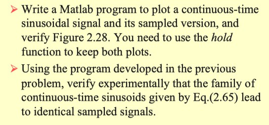
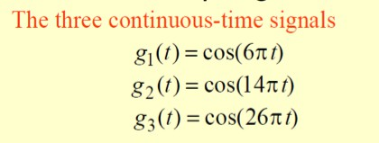
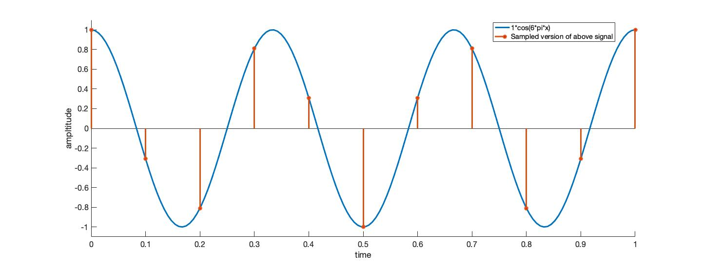
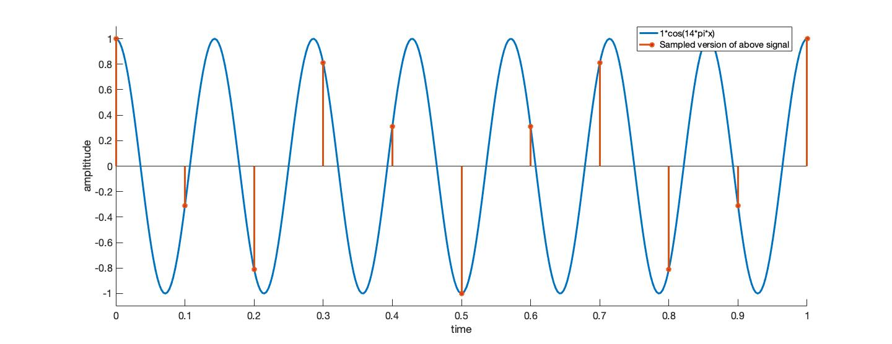
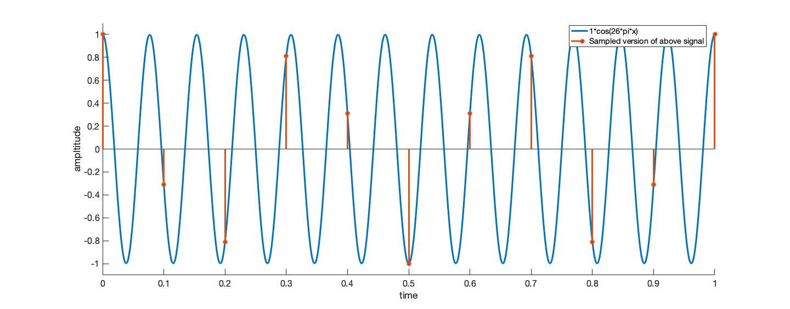
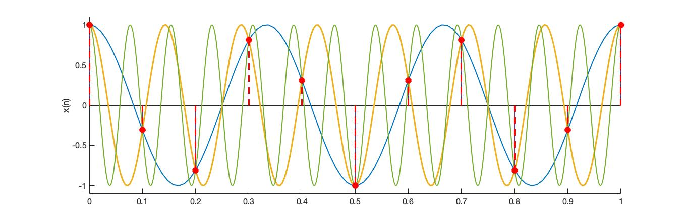
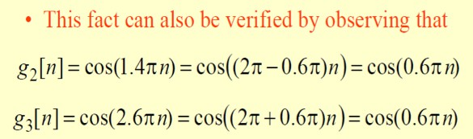
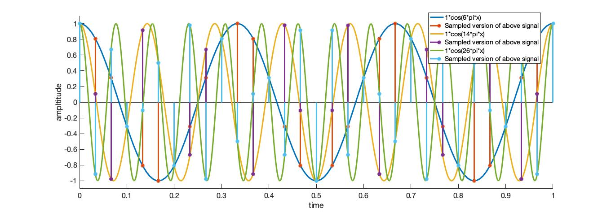
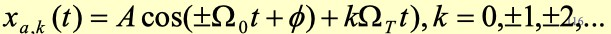
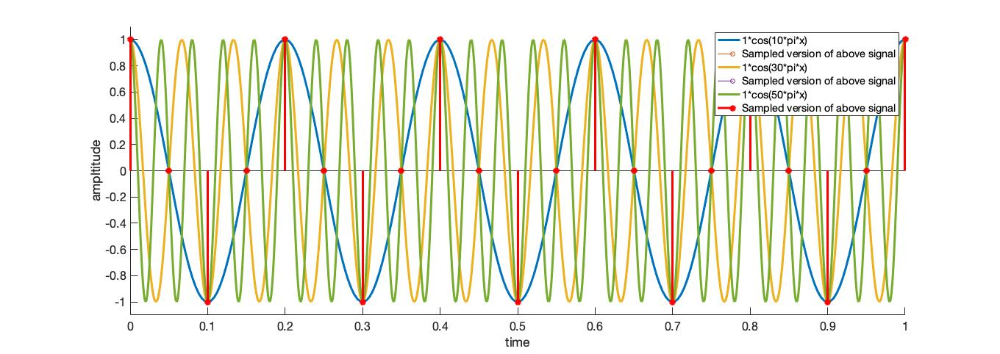

# DSP-HW1




## 算法描述

1. 选择生成连续余弦信号序列

$$
x(n) = U_m * cos(2 \pi*f*n)
$$

​	用户可以输入振幅 Um 和频率 f

​	根据图 2.28，只显示 0 ～$2\pi$ 内的连续信号波形


2. 根据用户输入的采样频率得到 0 ～$2\pi$ 内的采样个数，并使用 linspace 等间隔生成离散时间序列，最后根据连续信号的公式得到离散信号的采样点并使用 stem 二维脉冲杆图进行绘制。

   

3. 用户可以输入总共要生成的信号个数，通过 hold on 来绘制在一张图上


## 源码

```matlab
clear;

n = input('Input the number of continuous-time signal you wanna draw:\n');

% 频率
frequency = [];
% 振幅
Um = [];
% 采样频率
sf = input('Input the sampling rate:\n');
% 离散信号的采样点序列
dt = linspace(0,1,sf+1);
for x = 1:n
    frequency(x) = input('Input the frequency of the cos(x):\n');
    Um(x) = input('Input the amplitude of the cos(x):\n');
    nn = linspace(0,1,50*frequency(x));
    xx = Um(x) * cos(2 * pi * frequency(x) * nn);
    hold on
    plot(nn,xx,'DisplayName',[num2str(Um(x)),'*cos(',num2str(2*frequency(x)),'*pi*x)']);
    axis([0, 1, 1.1 * min(xx), 1.1 * max(xx)]);
    xlabel('time');
    ylabel('ampltitude');
    % 离散正弦信号
    dx = Um(x) * cos(2 * pi * frequency(x) * dt);
    stem(dt,dx,'DisplayName','Sampled version of above signal');
end
legend
```


## 结果展示

> 具体结果见Assets/



频率分别为 3Hz ， 7Hz 和 13Hz，振幅都为 1，采样频率为 10Hz

单独显示结果：







绘制在同一张图上



此时发现三个连续信号在采样点的值相同，原因可以由[三角函数公式](https://baike.baidu.com/item/%E4%B8%89%E8%A7%92%E5%87%BD%E6%95%B0%E5%85%AC%E5%BC%8F)得到



这就是奈氏采样定理对于数字连续信号的采样频率必须大于其中频率最大值的两倍（我理解的就是相邻采样点在最高频率波形的波峰和波谷之间），如果不能满足上述条件，采样后信号的频率就会重叠，即高于采样频率一半的频率成分将被重建成低于采样频率一半的信号，成为[混叠（aliasing）](https://zh.wikipedia.org/wiki/%E9%87%87%E6%A0%B7%E5%AE%9A%E7%90%86)。

以下两种措施可避免混叠的发生：

1. 提高采样频率，使之达到最高信号频率的两倍以上；
2. 引入[低通滤波器](https://zh.wikipedia.org/wiki/%E4%BD%8E%E9%80%9A%E6%BB%A4%E6%B3%A2%E5%99%A8)或提高[低通滤波器](https://zh.wikipedia.org/wiki/%E4%BD%8E%E9%80%9A%E6%BB%A4%E6%B3%A2%E5%99%A8)的参数；该[低通滤波器](https://zh.wikipedia.org/wiki/%E4%BD%8E%E9%80%9A%E6%BB%A4%E6%B3%A2%E5%99%A8)通常称为[抗混叠滤波器](https://zh.wikipedia.org/wiki/%E6%8A%97%E6%B7%B7%E7%96%8A%E6%BF%BE%E6%B3%A2%E5%99%A8)


如下当增大采样频率到 30 时，发现一些采样点不会发生重叠的情况，可以还原成原连续信号




根据三角函数公式和如下余弦函数族



生成频率分别为 5Hz，15Hz，25Hz 的连续余弦波形并设置采样频率为 20Hz（T = 0.05）
$$
cos_1(n) = cos_1(2\pi*5*0.05*n) = cos_1(0.5\pi*n)
$$

$$
cos_2(n) = cos_2(2\pi*15*0.05*n) = cos_2(1.5\pi*n)
$$

$$
cos_3(n) = cos_3(2\pi*25*0.05*n) = cos_3(2.5\pi*n)
$$


$$
cos((2\pi-0.5\pi)*n)=cos((2\pi+0.5)*n)=cos(0.5\pi*n)
$$


发现采样点的值相同，验证了上述公式

