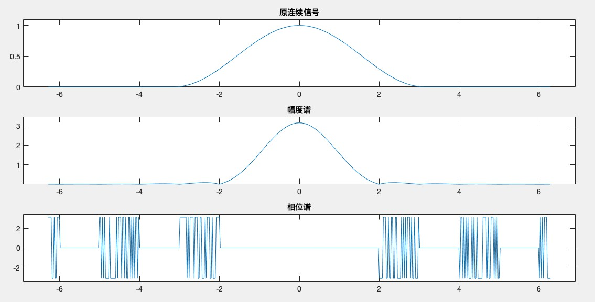
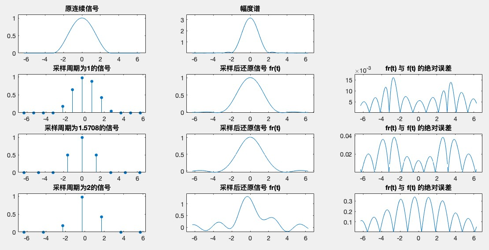

[TOC]

# Project 1


## A

Plot this signal and its frequency spectrum;

### 实现过程和结果

利用连续时间信号傅立叶变换的数值计算方法，根据 CTFT ，当 $\tau$ （时间间隔，即采样周期）取足够小的时候，可以得到如下近似


因为题目中的信号是时限的，i.e. 当 t < $-\pi$ 或者 t > $\pi$ 时，f(t) 为 0。所以上式中的 n 取值是有限的，设为 N，有：


其中 n$\tau$ 为采样时间序列，$\omega_k$ 为角频率的序列

对角频率 $\omega$ 进行抽样：


最后将 n$\tau$ 转置为 Nx1 的列向量并且和 1xM 的行向量 $\omega_k$ 进行内积并根据 （2）式得到 1xM 的结果。（这里对 $\omega$ 的采样点个数和时域上的采样点个数相同，即 N = M，并且角频域范围是 0 ～ $\omega_s$（采样频率*2$\pi$））

代码如下：

```matlab
clear;

% 连续信号
% 时间间隔
Ts = 2*pi/500;
% 时间序列，采样范围 -2*pi ~ 2*pi
t = -2*pi:Ts:2*pi;
% 采样点个数
N = length(t);
% 1 x N
f = ((1 + cos(t)) / 2) .* (abs(t) <= pi);
% 频率采样序列
k = 0:N-1;
% 1 x M （=N）
w = (2*pi*k)/(N*Ts);
% w = linspace(-2*pi,2*pi,500) ;
%  N x M
e = exp(-j*t'*w);
% 1 x M
F1 = f*e*Ts;

subplot(311),plot(t,f);
axis([min(t)*1.1 max(t)*1.1 min(f)*1.1 max(f)*1.1]);
title('原连续信号');

subplot(312),plot(w,abs(F1));
axis([min(w)*1.1 max(w)*1.1 min(abs(F1))*1.1 max(abs(F1))*1.1]);
title('幅度谱');

subplot(313),plot(w,angle(F1));
axis([min(w)*1.1 max(w)*1.1 1.1*min(angle(F1)) 1.1*max(angle(F1))]);
title('相位谱');
```

输出结果：


------

由于按照时域信号的采样频率 fs*2$\pi$ 绘制幅度谱和相位谱 ，导致横坐标范围过大，显示的高频信号过多，并且高频信息的幅度值过于小，故将 $ \omega$ 范围缩小为 $(-2\pi,2\pi)$ 。

```matlab
w = linspace(-2*pi,2*pi,500) ;
```

重新计算并绘图如下：



由于此信号是时限信号，不是严格的带限信号，从频谱上看，不存在截止频率使得其幅度值为 0，但信号中不同成分的角频率主要集中在 2 以内。

------


## B

When the sampling period satisfies T = 1 ， T = p / 2 ， T = 2 , respectively, please plot the sampling signal f p (n) and its frequency spectrum, respectively. Please give explanation of these results;

### 实现过程和结果

首先对原连续信号进行采样，然后使用 DTFT，i.e. 信号在时域上是离散的、非周期的，而在频域上则是连续的、周期性的。


代码

```matlab
clear;

dt = 0.001;
f0 = 1/(2*pi);
T0 = 1/f0;
t = -2*pi:dt:2*pi;
w1 = linspace(-2*pi,2*pi,500);
f = ((1 + cos(2*pi*f0*t)) / 2) .* (abs(t) <= pi);
F1 = f*exp(-j*t'*w1)*dt;
subplot(431),plot(t,f);
axis([min(t)*1.1 max(t)*1.1 min(f)*1.1 max(f)*1.1]);
title('原连续信号');
subplot(432),plot(w1,abs(F1));
axis([-2*pi*1.1 2*pi*1.1 1.1*min(abs(F1)) 1.1*max(abs(F1))]);
title('幅度谱');
subplot(433),plot(w1,angle(F1));
axis([-2*pi*1.1 2*pi*1.1 1.1*min(angle(F1)) 1.1*max(angle(F1))]);
title('相位谱');

% sampling period
Ts = [1 pi/2 2];

for x = 1:3
    n = -pi:Ts(x):pi;
    w = linspace(-2*pi,2*pi,500);
    f = ((1 + cos(2*pi*f0*n)) / 2) .* (abs(n) <= pi);
    F = f*exp(-j*n'*w)*Ts(x);
    
    subplot(4,3,x*3+1),stem(n,f,'filled');
    axis([min(n)*1.1 max(n)*1.1 min(f)*1.1 max(f)*1.1]);
    title(['采样周期为',num2str(Ts(x)),'的信号']);
    
    subplot(4,3,x*3+2),plot(w,abs(F));
    title('幅度谱');

    subplot(4,3,x*3+3),plot(w,angle(F));
    title('相位谱');
end
```

结果如下：


------

分析：

离散时间信号大多由连续时间信号(模拟信号)抽样获得，时域信号的离散会导致频域的周期延拓，只有满足不低于信号最高频率两倍的采样频率采样，才不会导致频域周期延拓后的混叠，才有可能不失真地恢复源信号。 假设有限带宽信号 xa(t) 的最高频率为 fm，抽样信号 fp(t) 的周期 Ts 及抽样频率 Fs 的取值必须符合奈奎斯特 (Nyquist) 定理：Fs ≥ 2fm，才不会发生混叠现象。

由于原信号为时限信号，所以为非带限信号，没有最大带宽 fm，故三个离散信号的幅度谱均发生了不同程度的混叠，采样周期越长，两个波峰之间的距离越短，其损失的频率成分越多，尤其当采样周期为 2 时，频谱出现了镜像对称的部分，且对称点的幅度值明显不为 0 ，说明高频部分混叠到已有低频部分，造成高频消失，这是由于欠采样造成的混叠现象，因此无法重建原信号。

另一方面，由于原连续信号的幅度谱在当 w 大于 2 的时候衰减得很厉害，可以设置适当的频率 wm （如 2）为信号的带宽，这样在当 ws 大于等于 4 时，便不会发生混叠现象。

------


## C

Using lowpass filter with cutting frequency wc = 2.4 to reconstruct signal fr (t ) from fp (n) . When the sampling period satisfies T = 1 ， T = 2 , respectively, please plot the reconstructed signal fr (t ) , and plot the absolute error between the reconstructed signal fr (t ) and the original signal f (t ) . Please analyze these results.

### 实现过程和结果

在频域上看，恢复信号就是用一个理想低通滤波器与时域信号的频谱相乘，以得到频域的第一个周期，而频域的理想低通滤波器，也就是频域矩形窗，经过傅里叶逆变化后在时域是无限长的内插函数，是非因果的 ，由于频域相乘对应着时域卷积，信号重建可以用时域信号与内插函数进行卷积积分来求解。公式如下：


代码：

```matlab
clear;

dt = 2*pi/500;
f0 = 1/(2*pi);
T0 = 1/f0;
t = -2*pi:dt:2*pi;
% N = length(t);
% k = 0:N-1;
% wm = 2*pi*fm;
% w1 = k*wm/N;
w1 = linspace(-2*pi,2*pi,500);
f = ((1 + cos(2*pi*f0*t)) / 2) .* (abs(t) <= pi);
F1 = f*exp(-j*t'*w1)*dt;

subplot(431),plot(t,f);
axis([min(t)*1.1 max(t)*1.1 min(f)*1.1 max(f)*1.1]);
title('原连续信号');
subplot(432),plot(w1,abs(F1));
axis([-2*pi*1.1 2*pi*1.1 1.1*min(abs(F1)) 1.1*max(abs(F1))]);
title('幅度谱');

Ts = [1 pi/2 2];

for x = 1:3
    n1 = -2*pi:Ts(x):2*pi;
    % 抽样信号
    f1 = ((1 + cos(2*pi*f0*n1)) / 2) .* (abs(n1) <= pi);
    % 生成 n 序列
    n = -2*pi/Ts(x):2*pi/Ts(x);
    % 生成 t 序列
    t1 = -2*pi:dt:2*pi;
    % 生成 f(n*Ts(x))
    x1 = (1+cos(2*pi*f0*n*Ts(x))) / 2 .* (abs(n*Ts(x)) <= pi);
    % 生成 t-nT 矩阵
    t_nT = ones(length(n),1)*t1-n'*Ts(x)*ones(1,length(t1));
    % 内插公式
    xa = x1*Ts(x)/pi*(sin(2.4*t_nT)./(t_nT));

    subplot(4,3,x*3+1),stem(n1,f1,'filled');
    axis([min(n1)*1.1 max(n1)*1.1 min(f1)*1.1 max(f1)*1.1]);
    title(['采样周期为',num2str(Ts(x)),'的信号']);
    
    subplot(4,3,x*3+2),plot(t1,xa);
    axis([-2*pi*1.1 2*pi*1.1 1.1*min(xa) 1.1*max(xa)]);
    title('采样后还原信号 fr(t)');

    subplot(4,3,x*3+3),plot(t1,abs(xa-f));
    axis([-2*pi*1.1 2*pi*1.1 1.1*min(abs(xa-f)) 1.1*max(abs(xa-f))]);
    title('fr(t) 与 f(t) 的绝对误差');
end
```

结果如下：



------

或者直接使用理想低通滤波函数与幅度谱进行乘积，最后逆傅立叶变换还原得到原信号。

代码：

```matlab
clear;

dt = 4*pi/500;
f0 = 1/(2*pi);
T0 = 1/f0;
t = -2*pi:dt:2*pi;
% N = length(t);
% k = 0:N-1;
% wm = 2*pi*fm;
% w1 = k*wm/N;
w1 = linspace(-2*pi,2*pi,500);
f1 = ((1 + cos(2*pi*f0*t)) / 2) .* (abs(t) <= pi);
F1 = f1*exp(-j*t'*w1)*dt;

subplot(431),plot(t,f1);
axis([min(t)*1.1 max(t)*1.1 min(f1)*1.1 max(f1)*1.1]);
title('原连续信号');
subplot(432),plot(w1,abs(F1));
axis([-2*pi*1.1 2*pi*1.1 1.1*min(abs(F1)) 1.1*max(abs(F1))]);
title('幅度谱');

Ts = [1 pi/2 2];
% 理想低通滤波器
w = linspace(-2*pi,2*pi,500);
dw = 4*pi/500;
wc = (abs(w) <= 2.4);

for x = 1:3
    n = -2*pi:Ts(x):2*pi;
    f = ((1 + cos(2*pi*f0*n)) / 2) .* (abs(n) <= pi);
    F = f*exp(-j*n'*w)*Ts(x);

    % 与理想低通滤波器相乘进行滤波
    F = F .* wc;

    % 逆傅立叶变换还原到原信号
    t = -2*pi:dt:2*pi;
    xa = real((F*exp(j*w'*t)*dw)) / (2 * pi);

    subplot(4,3,x*3+1),stem(n,f,'filled');
    axis([min(n)*1.1 max(n)*1.1 min(f)*1.1 max(f)*1.1]);
    title(['采样周期为',num2str(Ts(x)),'的信号']);
    
    subplot(4,3,x*3+2),plot(t,xa);
    axis([-2*pi*1.1 2*pi*1.1 1.1*min(xa) 1.1*max(xa)]);
    title('采样后还原信号 fr(t)');

    subplot(4,3,x*3+3),plot(t,abs(xa-f1));
    axis([-2*pi*1.1 2*pi*1.1 1.1*min(abs(xa-f1)) 1.1*max(abs(xa-f1))]);
    title('fr(t) 与 f(t) 的绝对误差');
end
```

和之前的方法结果相同：


------

分析：

一个理想的低通滤波器能够完全剔除高于截止频率的所有频率信号并且低于截止频率的信号可以不受影响地通过。一个理想的低通滤波器可以用数学的方法（理论上）在频域中用信号乘以矩形函数得到，也可以在时域与sinc函数作卷积得到。然而，这样一个滤波器对于实际真正的信号来说是不可实现的，这是因为 sinc 函数是一个延伸到无穷远处的函数，所以这样的滤波器为了执行卷积就需要预测未来并且需要有过去所有的数据。对于预先录制好的数字信号（在信号的后边补零，并使得由此产生的滤波后的误差小于量化误差）或者无限循环周期信号来说这是可实现的，所以对于题目中的信号不能完全被重建。

发现对于采样周期为 1 和 $\pi/2$ 的离散信号，可以较为准确地重建到原信号，但仍然与原信号存在绝对误差，且后者的绝对误差相比前者的大，除了上述原因外，还因为原始的模拟信号 xa（t）不是严格带限产生的，即不存在最高带宽 wm，在频谱图上表示为当 w > wm 时，幅度值为 0，所以低通滤波器的截止频率未能满足：


故未保留全部的信息，不能完全恢复到原始模拟信号，只能是越高的采样频率，保留的高频成分越多。

而对于采样周期为 2 的离散信号，误差较为明显，说明频谱的混叠现象较为严重，导致一些低频成分和高频成分的同时丢失。


