# Project 2

Design a lowpass filter. The specifications are given as follows: 

- stopband edge: 5 rad/sec 
- passband edge: 3 rad/sec 
- maximum passband attenuation: 0.3dB 
- minimum stopbandband attenuation: 40dB 
- sampling frequency: 15 rad/sec


## (a)

Use each of the following approximation for the design: 

- Butterworth approximation
- Chebyshev approximation
- Elliptic approximation. 

Plot the gain response of the designed filters for each case. Give the main design steps. Comment on your results.


### Butterworth approximation

在 MATLAB 下，设计巴特沃斯 IIR 滤波器可使用 butter 函数。 

butter 函数可设计低通、高通、带通和带阻的数字和模拟 IIR 滤波器，其特性为使通带内的幅度响应最大限度地平坦，但同时损失截止频率处的下降斜度。在期望通带平滑的情况下，可使用 butter 函数。 

```matlab
% butter函数的用法为： 

[b,a] = butter(n,Wn,'ftype') 

% 其中 n 代表滤波器阶数，Wn 代表滤波器的截止频率，这两个参数可使用 buttord 函数来确定。
```

buttord 函数可在给定滤波器性能的情况下，求出巴特沃斯滤波器的最小阶数 n，同时给出对应的截止频率 Wn。

```matlab
% buttord 函数的用法为： 

[n,Wn] = buttord(Wp,Ws,Rp,Rs) 

% 其中 Wp 和 Ws 分别是通带和阻带的拐角频率（截止频率），其取值范围为 0 至 1 之间。当其值为 1 时代表采样频率的一半。对于低通滤波器，Wp 和 Ws 为一元矢量且 Wp<Ws；Rp 和 Rs 分别是通带和阻带区的波纹系数。 
```

参考课件，使用数字滤波器系数直接法求解。源码 src/a/butterworth.m

```matlab
clear;

% 采样频率
Fs = 15;
% 数字滤波器的通带截止频率
fp = 3;
% 数字滤波器的阻带截止频率
fs = 5;
% 通带波纹系数
rp = 0.3;
% 阻带波纹系数
rs = 40;
ws = fs/(Fs/2);
wp = fp/(Fs/2);
[n,wn] = buttord(wp,ws,rp,rs);
[b,a] = butter(n,wn);
freqz(b,a);
```

幅度响应和相位响应：

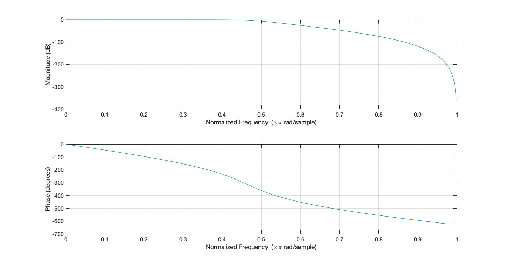

阶数和滤波器的截止频率：

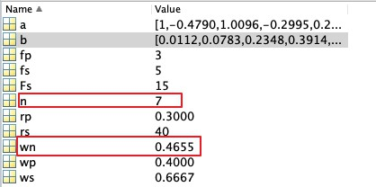


------


### Chebyshev approximation I

在期望通带下降斜率大的场合，应使用椭圆滤波器或契比雪夫滤波器。在 MATLAB 下可使用 cheby1 函数设计出契比雪夫 I型IIR 滤波器。

与 butter 函数类似，cheby1 函数可设计低通、高通、带通和带阻契比雪夫 I型滤IIR 波器，其通带内为等波纹，阻带内为单调，其通带内的波纹由 rp(分贝) 确定。 其它各公式的使用方法与 butter 函数相同，可参考相应公式。契比雪夫 I 型的下降斜度比 II 型大，但其代价是通带内波纹较大。

```matlab
% cheby1 函数的用法为： 

[b,a] = cheby1(n,Rp,Wn,'ftype') 
% 在使用 cheby1 函数设计 IIR 滤波器之前，可使用 cheb1ord 函数求出滤波器阶数 n 和截止频率 Wn。cheb1ord 函数可在给定滤波器性能的情况下，选择契比雪夫I型滤波器的最小阶 n 和截止频率 Wn。
```

```matlab
% cheb1ord 函数的用法为： 

[n,Wn] = cheb1ord(Wp,Ws,Rp,Rs) 

% 其中 Wp 和 Ws 分别是通带和阻带的拐角频率（截止频率），其取值范围为0至1之间。当其值为1时代表采样频率的一半。Rp 和 Rs 分别是通带和阻带区的波纹系数。
```

参考课件，使用数字滤波器系数直接法求解。源码 src/a/cheb1.m

```matlab
...
[n,wn] = cheb1ord(wp,ws,rp,rs);
[b,a] = cheby1(n, rp, wn);
...
```

幅度响应和相位响应：

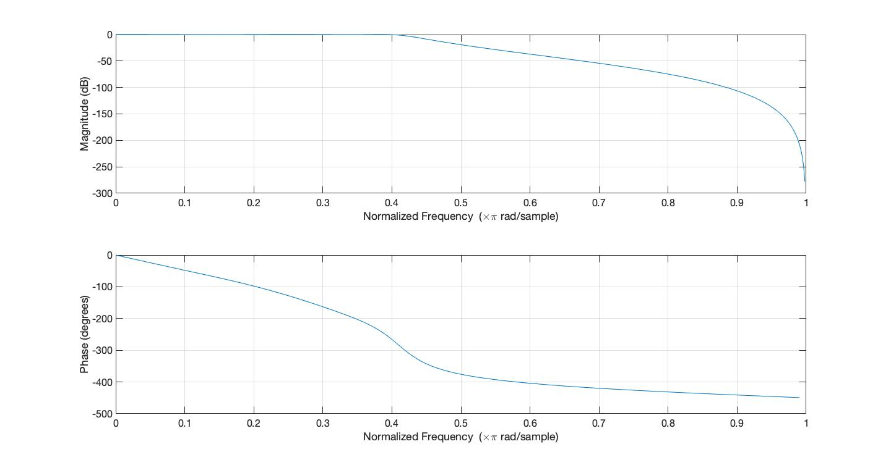

阶数和滤波器的截止频率：
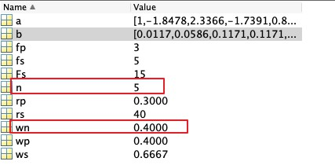


------


### Chebyshev approximation II

在阻带上频率响应幅度等波纹波动的滤波器称为 “II型切比雪夫滤波器"，cheby2 函数其通带内为单调，阻带内为等波纹， 因此，由 rs 确定阻带内的波纹。其它各公式的使用方法与 butter 函数相同，可参考相应公式。

```matlab
...
[n,wn] = cheb2ord(wp,ws,rp,rs);
[b,a] = cheby2(n, rs, wn);
...
```

幅度响应和相位响应：

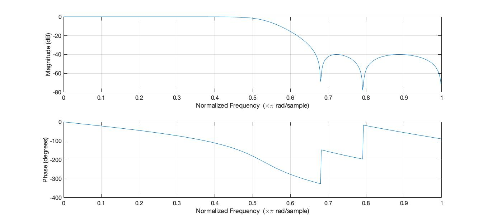

阶数和滤波器的截止频率：
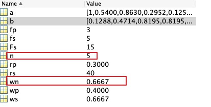

------


## Elliptic approximation

Ellip 函数可得到下降斜度更大的滤波器，但在通带和阻带内均为等波动的。椭圆滤波器能以最低的阶数实现指定的性能。

ellipord 函数的功能是求滤波器的阶数 。该函数可以得到数字椭圆型滤波器的最小阶数 n 和截止频率 Wn ,并使滤波器在通带内 (0 , wp) 的波纹系数小于通带最大衰减 rp ，阻带内 (ws , 1) 的波纹系数大于阻带最小衰减 rs 

```matlab
...
[n,wn] = ellipord(wp,ws,rp,rs);
[b,a] = ellip(n, rp, rs, wn);
...
```

幅度响应和相位响应：

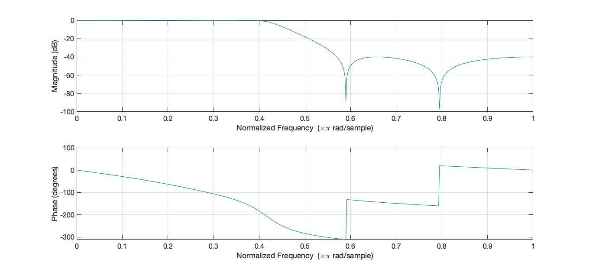

阶数和滤波器的截止频率：
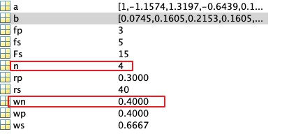

------


对比结果：

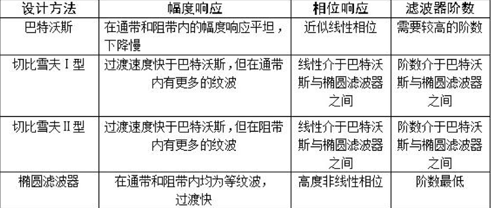

------


## (b)

Use each of the following windows for the design: 

- Hamming
- Hann
- Blackman
- Kaiser

Show the ideal impulse response, the actual impulse response, and plot the gain response of the designed filters for each case. Give the main design steps. Comment on your results. Do not use the function fir1 of Matlab.


### 实验设计步骤

1. 对给定频率进行归一化：

   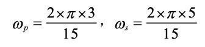

2. 确定通带截止频率：

   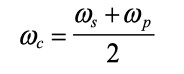

3. 确定窗口的长度 M，N

   归一化的过渡带宽为：

   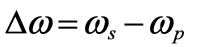

   对于 Hann、Hamming 、Blackman 窗用下面的函数计算 M，N。c 通过查表得,分别为 3.11pi ,3.32 pi ,5.56 pi 。

   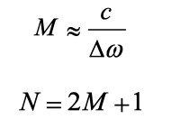

   对于 Kaiser 窗，M、N 用下面的公式计算，其中 $\alpha_s$ 为最小阻带衰减为：40dB。

   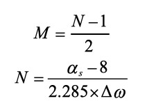

   

4. 计算理想低通的脉冲响应

   现在假设我们要设计一个低通滤波器，截止频率为 ![[公式]](https://www.zhihu.com/equation?tex=%5Comega_c) ，其理想频率响应可以用如下函数表示：


   ![[公式]](https://www.zhihu.com/equation?tex=H_d%28e%5E%7Bj%5Comega%7D%29%3D%5Cleft%5C%7B+%5Cbegin%7Baligned%7D+1++%2C%5Cquad+%26%5Cleft%7C+%5Comega+%5Cright%7C+%5Cleq+%5Comega_c%5C%5C+0%2C+%5Cquad%26+%5Cleft%7C+%5Comega+%5Cright%7C+++%3E%5Comega_c+%5C%5C+%5Cend%7Baligned%7D+%5Cright.)

   根据傅立叶反变换，该滤波器的脉冲响应为：

   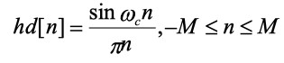

5. 使用 MATLAB 函数产生窗函数的系数 win

   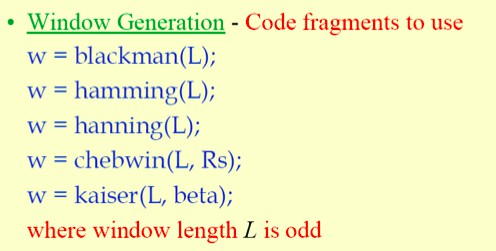

   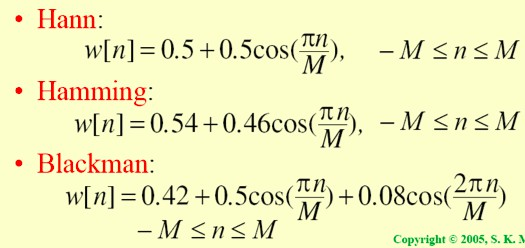

   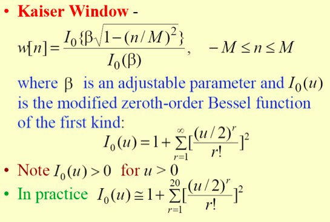

   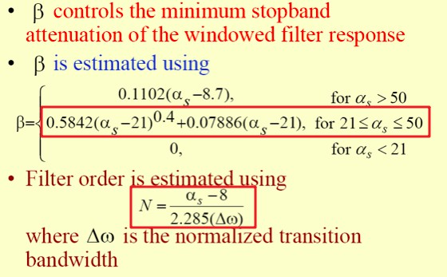

   6. 对理想低通滤波器的脉冲响应加窗	

      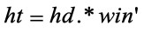

   7. 画出频谱图


具体源码见 src/b


### 实验结果

说明

- 左图：理想冲激响应

- 中间：各窗真实冲激响应

- 右图：各窗低通滤波器增益响应


Hamming：

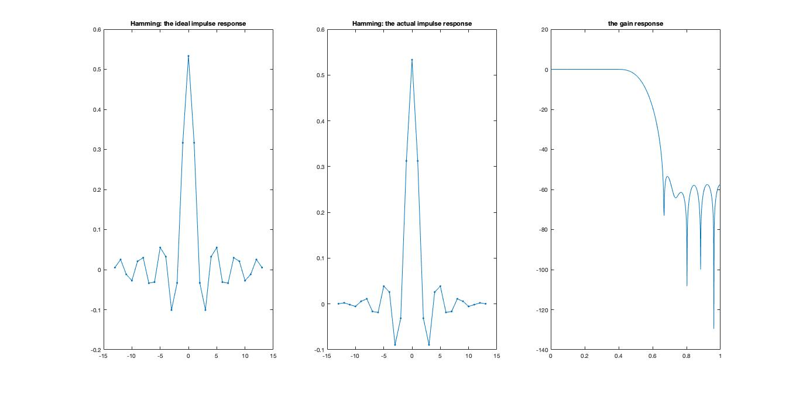

阶数和冲激响应系数：

```
N = 27
0.000407263671633730	0.00235541541832624	-0.00156174341366651	-0.00539434128437660	0.00579359357857595	0.0111439385476271	-0.0163744584704205	-0.0185678056226576	0.0387649407042560	0.0259360527717266	-0.0892364248367572	-0.0313466445368349	0.312334686291914	0.533333333333333	0.312334686291914	-0.0313466445368349	-0.0892364248367572	0.0259360527717266	0.0387649407042560	-0.0185678056226576	-0.0163744584704205	0.0111439385476271	0.00579359357857595	-0.00539434128437660	-0.00156174341366651	0.00235541541832624	0.000407263671633730
```

------


Hann:

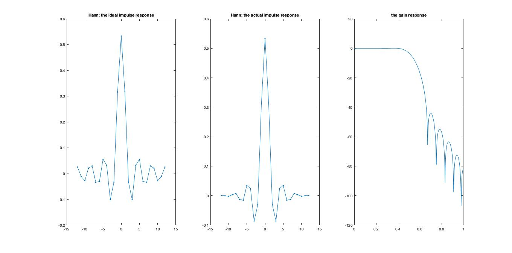

阶数和冲激响应系数：

```
N = 25
0	-0.000200523870865448	-0.00184660165365265	0.00304442741660384	0.00739219827549319	-0.0125233293179921	-0.0155914880631440	0.0347011656836144	0.0242753052307940	-0.0861322693763798	-0.0308735520155991	0.311172786306390	0.533333333333333	0.311172786306390	-0.0308735520155991	-0.0861322693763798	0.0242753052307940	0.0347011656836144	-0.0155914880631440	-0.0125233293179921	0.00739219827549319	0.00304442741660384	-0.00184660165365265	-0.000200523870865448	0
```

------


Blackman:


阶数和冲激响应系数：

```
N = 43
0	2.79856111756912e-05	5.66437352376448e-05	-0.000326188118772632	-0.000140566646691008	0.00117629000700792	-1.88054928518498e-18	-0.00293954283370394	0.000909650585620900	0.00597040483689441	-0.00357248323433056	-0.0104272442739250	0.00954579413516940	0.0160862029529129	-0.0212895310334204	-0.0222628745785207	0.0436930544264702	0.0279116381431180	-0.0928741048328577	-0.0318951384159682	0.313673128473379	0.533333333333333	0.313673128473379	-0.0318951384159682	-0.0928741048328577	0.0279116381431180	0.0436930544264702	-0.0222628745785207	-0.0212895310334204	0.0160862029529129	0.00954579413516940	-0.0104272442739250	-0.00357248323433056	0.00597040483689441	0.000909650585620900	-0.00293954283370394	-1.88054928518498e-18	0.00117629000700792	-0.000140566646691008	-0.000326188118772632	5.66437352376448e-05	2.79856111756912e-05	0
```

------


Kaiser:


阶数和冲激响应系数：

```
N = 17
0.0278037192827578	-0.0322428505879738	-0.0301288040579175	0.0538351203292071	0.0318784042985759	-0.100051801824922	-0.0329649139194827	0.316266352020018	0.533333333333333	0.316266352020018	-0.0329649139194827	-0.100051801824922	0.0318784042985759	0.0538351203292071	-0.0301288040579175	-0.0322428505879738	0.0278037192827578
```

------


分析：

从左边和中间两幅图可以看出，Kaiser 窗比较接近理想系数，同时其阶数（N=17）也是最少的。

但从右边的图上发现，对于衰减性能，其余三个的最小阻带衰减比 Kaiser 的要好。

从减小泄漏观点出发，Hann 窗优于矩形窗。但 Hann 窗主瓣加宽，相当于分析带宽加宽，频率分辨力下降。


## (c)

Repeat (b) except for the ideal impulse response, by using the function fir1 of Matlab. Compare results of (b) with those of (c).


将 (b) 中计算得到的窗函数 win，直接带入 matlab 自带的函数 fir1，即可产生时域的加窗低通滤波的冲激响应：

```matlab
filter_t = fir1(N-1,wc/pi,win);
```

具体源码见 src/c


Hamming：

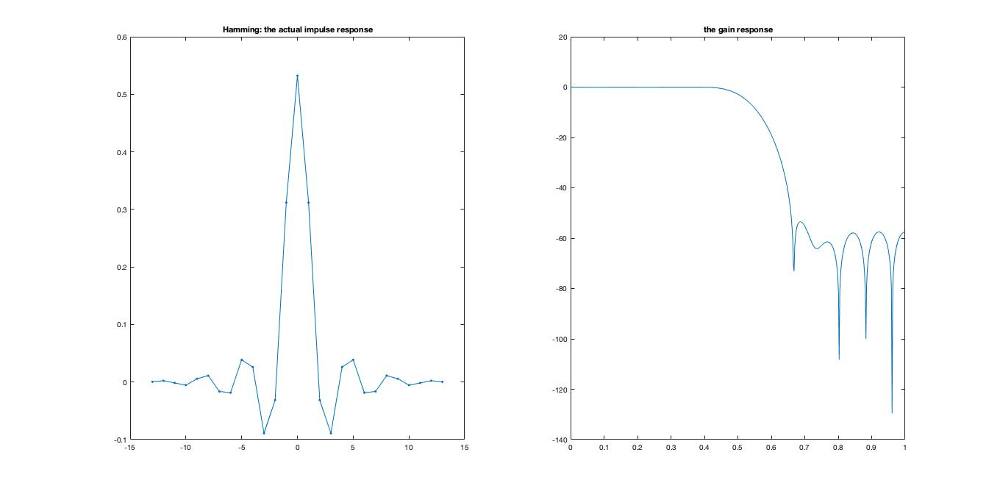

阶数和冲激响应系数：

```
N = 27
0.000406514758043162	0.00235108406559074	-0.00155887153741304	-0.00538442167754354	0.00578293979020397	0.0111234460568601	-0.0163443476224841	-0.0185336614478975	0.0386936561950970	0.0258883591919670	-0.0890723287584961	-0.0312890014673759	0.311760336779154	0.532352591348589	0.311760336779154	-0.0312890014673759	-0.0890723287584961	0.0258883591919670	0.0386936561950970	-0.0185336614478975	-0.0163443476224841	0.0111234460568601	0.00578293979020397	-0.00538442167754354	-0.00155887153741304	0.00235108406559074	0.000406514758043162
```

------


Hann:

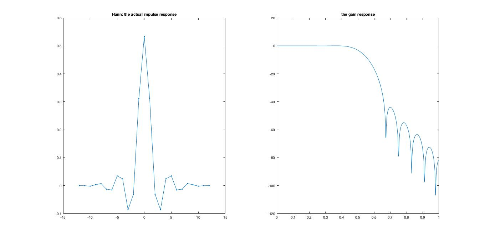

阶数和冲激响应系数：

```
N = 25
0.000406514758043162	0.00235108406559074	-0.00155887153741304	-0.00538442167754354	0.00578293979020397	0.0111234460568601	-0.0163443476224841	-0.0185336614478975	0.0386936561950970	0.0258883591919670	-0.0890723287584961	-0.0312890014673759	0.311760336779154	0.532352591348589	0.311760336779154	-0.0312890014673759	-0.0890723287584961	0.0258883591919670	0.0386936561950970	-0.0185336614478975	-0.0163443476224841	0.0111234460568601	0.00578293979020397	-0.00538442167754354	-0.00155887153741304	0.00235108406559074	0.000406514758043162
```

------


Blackman:


阶数和冲激响应系数：

```
N = 43
0	2.79861828995187e-05	5.66448924242043e-05	-0.000326194782537041	-0.000140569518356048	0.00117631403767928	-1.88058770331451e-18	-0.00293960288623127	0.000909669169060467	0.00597052680752722	-0.00357255621732798	-0.0104274572942507	0.00954598914816821	0.0160865315812735	-0.0212899659616444	-0.0222633293913809	0.0436939470408982	0.0279122083557351	-0.0928760021771162	-0.0318957900083347	0.313679536566469	0.533344228910090	0.313679536566469	-0.0318957900083347	-0.0928760021771162	0.0279122083557351	0.0436939470408982	-0.0222633293913809	-0.0212899659616444	0.0160865315812735	0.00954598914816821	-0.0104274572942507	-0.00357255621732798	0.00597052680752722	0.000909669169060467	-0.00293960288623127	-1.88058770331451e-18	0.00117631403767928	-0.000140569518356048	-0.000326194782537041	5.66448924242043e-05	2.79861828995187e-05	0
```

------


Kaiser:


阶数和冲激响应系数：

```
N = 17
0.0277447953188938	-0.0321745188463245	-0.0300649525802242	0.0537210284462965	0.0318108449219390	-0.0998397636909124	-0.0328950519209200	0.315596093954603	0.532203048793299	0.315596093954603	-0.0328950519209200	-0.0998397636909124	0.0318108449219390	0.0537210284462965	-0.0300649525802242	-0.0321745188463245	0.0277447953188938
```

------

发现各窗在两种计算方式下的实际冲激响应系数相差不多，阶数相同，由此可见结果是一致的。


